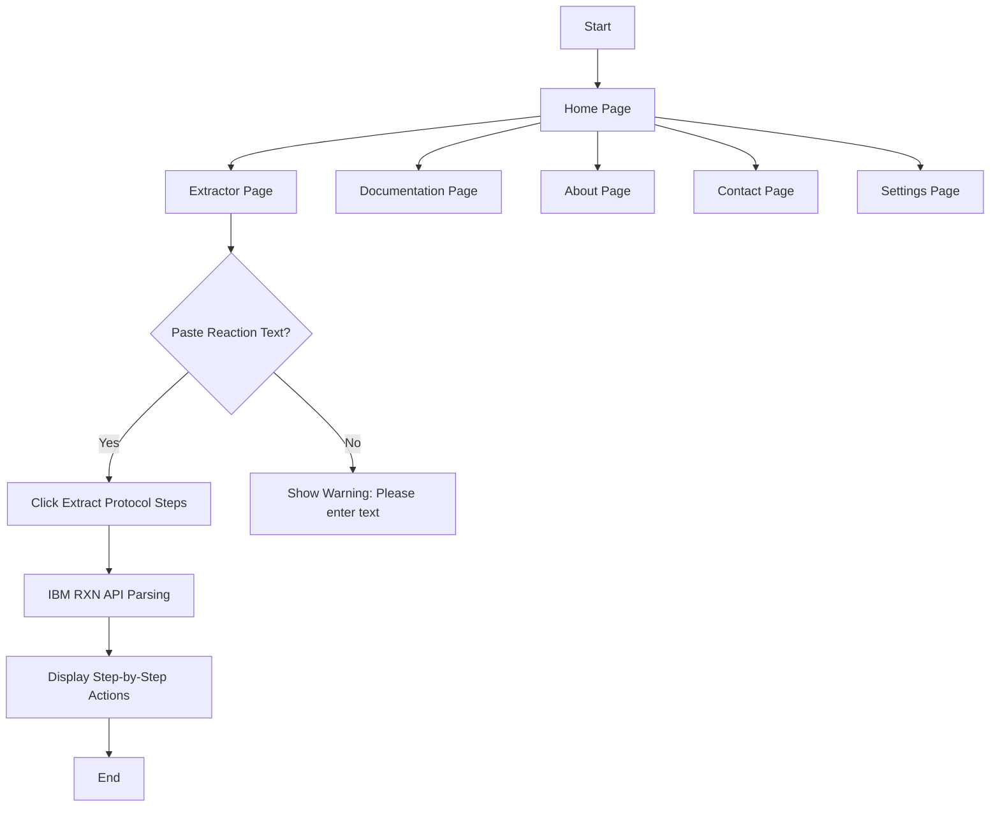

# 🧪 IBM RXN Chemistry Protocol Extractor

https://ibm-rxn-chemistry-protocol-extractor-app-2eifcvbwsz9iy73idwn2i.streamlit.app/


A **Streamlit-based web application** that uses the **IBM RXN for Chemistry API** to automatically extract **step-by-step chemical reaction protocols** from unstructured reaction procedure text.

This tool is useful for **chemists, researchers, and students** who want to convert plain-text synthesis descriptions into clear, structured laboratory steps.

---
# IBM-RXN

#Live LINK : https://ibm-rxn-physics-chemistry-protocol-extractor.streamlit.app/


flowchart TD

## 🚀 Features

* ⚗️ Extract **step-by-step synthesis actions** from reaction text
* 🎨 Clean and modern **Streamlit UI** with sidebar navigation
* 📘 Multiple pages: Home, Extractor, Documentation, About, Contact, Settings
* 🔄 Real-time protocol extraction using **IBM RXN API**
* 📚 Ideal for research, education, and lab workflow optimization

---

## 🛠️ Tech Stack

* **Frontend:** Streamlit
* **Backend API:** IBM RXN for Chemistry
* **Language:** Python
* **UI Components:** streamlit-option-menu

---

## 📂 Project Structure

```
├── app.py               # Main Streamlit application
├── requirements.txt    # Python dependencies
└── README.md            # Project documentation
```

---

## ⚙️ Installation & Setup

### 1️⃣ Clone the Repository

```bash
git clone <your-repository-url>
cd ibm-rxn-protocol-extractor
```

### 2️⃣ Create Virtual Environment (Optional but Recommended)

```bash
python -m venv venv
source venv/bin/activate   # On Windows: venv\Scripts\activate
```

### 3️⃣ Install Dependencies

```bash
pip install -r requirements.txt
```

---

## ▶️ Run the Application

```bash
streamlit run app.py
```

The app will open in your browser (usually at `http://localhost:8501`).

---

## 🧪 How to Use

1. Open the app in your browser
2. Navigate to **⚗️ Extractor** from the sidebar
3. Paste a **chemical reaction procedure** in the text area
4. Click **Extract Protocol Steps**
5. View the extracted **step-by-step synthesis actions**

---

## 🔑 IBM RXN API Key

The app uses the **IBM RXN for Chemistry API**.

⚠️ **Important:**

* For production use, store your API key securely (e.g., environment variables)
* Do **not** hard-code API keys in public repositories

Example (recommended):

```bash
export RXN_API_KEY="your_api_key_here"
```

---

## 👨‍🔬 Target Audience

* Chemists & laboratory researchers
* Chemistry students
* Educational institutions
* Research teams

---

## 📌 Notes

* Extraction quality depends on the clarity of the input reaction text
* IBM RXN API parsing accuracy may vary for complex reactions
* Ensure reaction procedures are complete and well-written

---

## 📞 Contact

* 📧 Email: [rohitkharche27@gmail.com](mailto:rohitkharche27@gmail.com)
* 🌐 IBM RXN Website: [https://rxn.res.ibm.com](https://rxn.res.ibm.com)

---

## 📄 License

This project is intended for **educational and research purposes**.

---

### ⭐ If you find this project useful, consider giving it a star!
